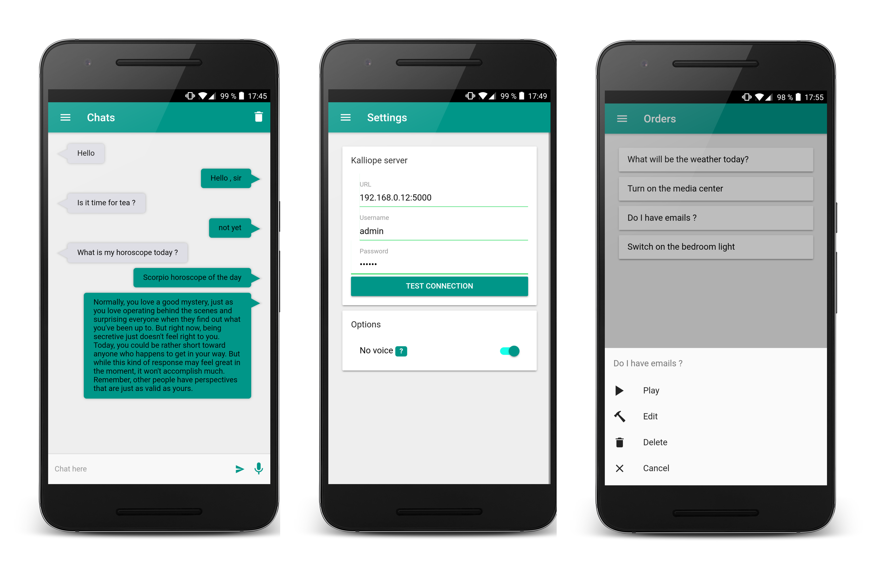

<p align="center">
    
</p>

# Kalliope

[](https://travis-ci.org/kalliope-project/kalliope)
[](https://coveralls.io/github/kalliope-project/kalliope)
[](https://gitter.im/kalliope-project/Lobby)
[](https://badge.fury.io/py/kalliope)
[](https://pypi.python.org/pypi/kalliope/)
[](https://beerpay.io/kalliope-project/kalliope)

Kalliope is a framework that will help you to create your own personal assistant.

The concept is to create the brain of your assistant by attaching an input **signal** (vocal order, scheduled event, MQTT message, GPIO event, etc..) to one or multiple actions called **neurons**.

You can create your own Kalliope bot, by simply choosing and composing the [existing neurons](https://kalliope-project.github.io/neurons_marketplace.html) without writing any code. But, if you need a particular module, you can write it by yourself, add it to your project and propose it to the community.

Kalliope can run on all Linux Debian based distribution including a Raspberry Pi and it's multi-lang. The only thing you need is a microphone.

Kalliope is easy-peasy to use, see the hello world

```yaml
- name: "Hello-world"
  signals:
    - order: "say hello"
  neurons:
    - say:
        message: "Hello world!"
```

If you want an idea of what you can do with Kalliope, click on the image below
[](https://www.youtube.com/watch?v=PcLzo4H18S4)

## Links

- [Documentation](https://kalliope-project.github.io/kalliope/)
- [Kalliope website](https://kalliope-project.github.io/)
- [Android app](https://play.google.com/store/apps/details?id=kalliope.project)
- [Chat](https://gitter.im/kalliope-project/Lobby)

<p align="center">
    
</p>

## Credits

> **Meaning of Kalliope** Kalliope means "beautiful voice" from Greek καλλος (kallos) "beauty" and οψ (ops) "voice".
> In Greek mythology she was a goddess of epic poetry and eloquence, one of the nine Muses.

- kə-LIE-ə-pee (English)
- Ka-li-o-pé (French)
- каллиопа (Russian)

## License

Copyright (c) 2018. All rights reserved.

Kalliope is covered by the GNU GENERAL PUBLIC LICENSE v3.0.
Permissions of this strong copyleft license are conditioned on making available complete source code of licensed works and modifications,
which include larger works using a licensed work, under the same license. Copyright and license notices must be preserved.
Contributors provide an express grant of patent rights.
For the full license text see the [LICENSE.md](LICENSE.md) file.
