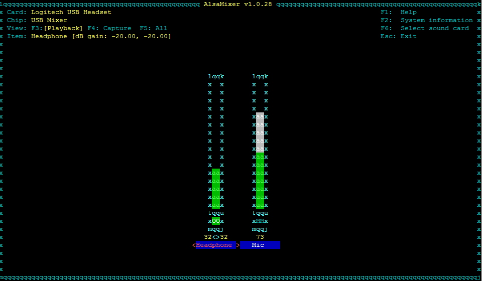

# Kalliope requirements for Raspberry Pi OS

Kalliope can be installed:

- [Via script](#install-via-script)
- [Manually](#manual-installation)

## Install via script

Just run the following bash command to install Kalliope on a freshly installed Raspberry Pi:
```
bash -c "$(curl -sL https://raw.githubusercontent.com/kalliope-project/kalliope/master/install/rpi_install_kalliope.sh)"
```

## Manual installation

> **Note:** It is recommended to use a **lite** installation of Raspberry Pi OS without any graphical interface for a better experience.

> **Note:** The first Raspberry Pi is not officially supported. The installation will works but a single core with only 700Mhz may produce latency.

> **Note:** Python 2 is not supported anymore

> **Note:** Raspbian was renamed to Raspberry Pi OS


### Debian packages requirements

Install the required system libraries and software:

```bash
sudo apt-get update
sudo apt-get install -y git python3-dev libsmpeg0 \
    flac libffi-dev portaudio19-dev build-essential libssl-dev libatlas3-base mplayer libyaml-dev libpython3-dev libjpeg-dev ffmpeg pulseaudio
```

On Raspberry Pi OS **Buster**, the default TTS engine is not installable directly from the package manager. Run command below to install it manually:
```
wget http://ftp.fr.debian.org/debian/pool/non-free/s/svox/libttspico-utils_1.0+git20130326-9_armhf.deb
wget http://ftp.fr.debian.org/debian/pool/non-free/s/svox/libttspico0_1.0+git20130326-9_armhf.deb
wget http://ftp.fr.debian.org/debian/pool/non-free/s/svox/libttspico-data_1.0+git20130326-9_all.deb
sudo dpkg -i libttspico-data_1.0+git20130326-9_all.deb
sudo dpkg -i libttspico0_1.0+git20130326-9_armhf.deb
sudo dpkg -i libttspico-utils_1.0+git20130326-9_armhf.deb
```

Install the last release of python-pip:
```bash
wget https://bootstrap.pypa.io/get-pip.py
sudo python3 get-pip.py
```

{!installation/manual_installation_common.md!}

## Raspberry Pi configuration

This section deals with the special configuration needed to get Kalliope working on a RPi.

### Pulseaudio configuration
> **Note:** If you installed Kalliope via script, you can skip this part

Add the pi user to the group pulse-access to allow to use the audio device:

```bash
sudo usermod -a -G pulse-access pi
``` 

Setting up default client settings by adding default server and disable autospawn to client.conf:
```bash
echo "default-server = /var/run/pulse/native" | sudo tee -a /etc/pulse/client.conf
echo 'autospawn = no' | sudo tee -a /etc/pulse/client.conf
```

Create a pulseaudio service in `/etc/systemd/system/pulseaudio.service`

```bash
[Unit]
Description=PulseAudio system server
After=network.target

[Service]
Type=notify
ExecStart=pulseaudio --daemonize=no --system --realtime --log-target=journal
Restart=always
RestartSec=30

[Install]
WantedBy=multi-user.target

```
Or use this command to download the script and move it to `/etc/systemd/system/`:
```bash
wget https://raw.githubusercontent.com/kalliope-project/kalliope/master/install/files/pulseaudio.service && sudo mv pulseaudio.service /etc/systemd/system/
```

There is a bug if you use the analog jack output of the raspberry with pulseaudio, the audio player needs about 2 seconds longer to start the audio. 
To speed it up add the following to the end of `/etc/pulse/system.pa`:

```bash
echo 'load-module module-alsa-sink device="hw:0,0"' | sudo tee -a /etc/pulse/system.pa
echo 'set-default-sink alsa_output.hw_0_0' | sudo tee -a /etc/pulse/system.pa
``` 

We disable load-module module-suspend-on-idle in `/etc/pulse/system.pa`  
```bash
sed -e '/load-module module-suspend-on-idle/ s/^#*/#/' -i /etc/pulse/system.pa
```

Now reload systemctl, start the service and enable it at startup:
```bash
sudo systemctl daemon-reload
sudo systemctl start pulseaudio
sudo systemctl enable pulseaudio
``` 

### Microphone and speaker configuration

Get the output card:
```bash
pactl list sinks short
```

Output example with a speaker connected to the Raspberry jack:
```bash
0   alsa_output.platform-soc_audio.analog-mono  module-alsa-card.c  s16le 1ch 44100Hz   IDLE
1   alsa_output.hw_0_0  module-alsa-sink.c  s16le 2ch 48000Hz   IDLE
```

Here we see that:
- the analog audio (where the jack is connected) is on card 0
- the fixed output (with less delay on pulseaudio) on card 1

> **Note:** If you use a USB sound card for output there is no delay at all.

Get the input (microphone card):
```bash
pactl list sources short
```

Output example with a PS3 eye (which has a great Mircophone array for a cheap price) connected:
```bash
0 alsa_output.platform-soc_audio.analog-mono.monitor  module-alsa-card.c  s16le 1ch 44100Hz SUSPENDED
1 alsa_input.usb-OmniVision_Technologies__Inc._USB_Camera-B4.09.24.1-01.multichannel-input  module-alsa-card.c  s16le 4ch 16000Hz SUSPENDED
```

Here we see:
- analog-mono.monitor which is used for e.g stereo mix (What we don't need)
- The PS3 eye USB camera with the built in microphone array

Now we can set our desire default input and output device.

To set the default output to the analog audio jack of the raspberry:

```bash
pactl set-default-sink 1
```

To set the default input, in this case the PS3 eye:

```bash
pactl set-default-source 1
```

Adjust the microphone sensibility by running alsamixer:
```bash
alsamixer
```

By pressing F5 you can set the microphone sensibility and speaker level for pulseaudio:


> **Note:** After changing the default input or output, you have to restart Kalliope

### HDMI / Analog audio

By default, the audio stream will use HDMI if something is plugged into this port.
Check the [official documentation](https://www.raspberrypi.org/documentation/configuration/audio-config.md) to switch from HDMI to analog.

```bash
sudo raspi-config
```

### Configure your locales

Locales defines language and country specific setting for your programs and shell session. 
To set system’s locale you need use shell variable. For example, LANG variable can be used to set en_US (English US) language. 

Check current locales:
```
locale
```

To update your locale, type the command bellow:
```
sudo dpkg-reconfigure locales
```

Select in the list the locales of your country, by selecting the code with UTF8, example:

- de_DE.utf8
- en_GB.utf8
- fr_FR.utf8
- es_ES.utf8

Then, update your `/home/pi/.bashrc` file by exporting the language. Example:
```
export LC_ALL="en_US.UTF-8"
export LANG="en_US.UTF-8"
export LANGUAGE="en_US.UTF-8"
```

Source the file to handle changes
```
source /home/pi/.bashrc
```

{!installation/check_env.md!}
