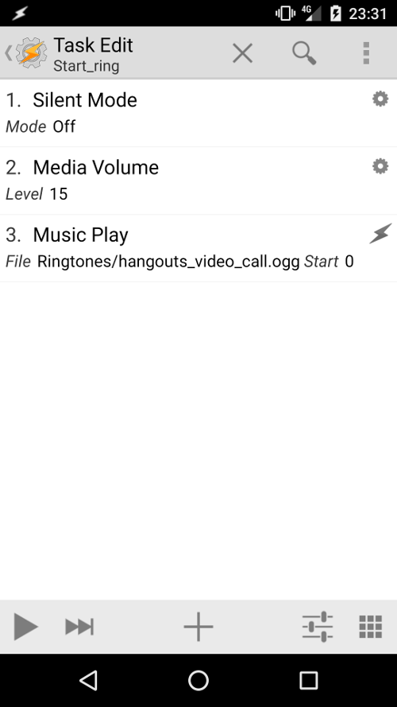

# Tasker autoremote

## Synopsis

[Tasker](https://play.google.com/store/apps/details?id=net.dinglisch.android.taskerm) is an application for Android which performs 
tasks (sets of actions) based on contexts (application, time, date, location, event, gesture) in user-defined profiles or in 
clickable or timer home screen widgets.

[Tasker autoremote](https://play.google.com/store/apps/details?id=com.joaomgcd.autoremote&hl=fr) is a plugin for Tasker that allow 
the program to receive push message from the cloud as profile.

This is how it works:
- Send an AutoRemote message from Kalliope
- Setup an AutoRemote profile in Tasker to react to the message
- Do whatever you like with that message!

The example usage is a "find my phone" task. 
You could send a "Where are you?" message to your phone, and have Tasker respond with a repetitive "I'm here! I'm here!" 
or play a music.


## Options

| parameter | required | default | choices | comment                                                       |
|-----------|----------|---------|---------|---------------------------------------------------------------|
| key       | yes      |         |         | API key. Can be found in your personal URL given by the app.  |
| message   | yes      |         |         | Message to send to your phone                                 |

## Return Values

None

## Synapses example

Description of what the synapse will do
```
- name: "find my phone"
  signals:
    - order: "where is my phone"
  neurons:
    - say:
        message: "I'll make your phone ringing, sir"
    - tasker_autoremote:
        key: "MY_VERY_LONG_KEY"
        message: "lost"
```


## Notes

### How to create a find my phone task
This walk through will show you how to send a message to your phone so that even if it is set to silent, 
will play any music file at full volume so you can find your phone if you have lost it in the couch.

First, create a task, that you could call "start_ringing" that will perform:
- Disable the silent mode
- Set media volume to the maximum value
- Play a local music



Then, create a new task with just one action:
- Stop the music


Create the input profile. 
- create a context of type Event > Plugin > Autoremote
- Set the word you want
- Attach the event to the task "start_ringing"


Finally, create a event, to stop the music when we unlock the phone
- create a context of type Event > Display > Display Unlocked
- Attach the event to the stop that stop the music


Exit Tasker with the exit menu to be sure all events and task have been saved.


 
